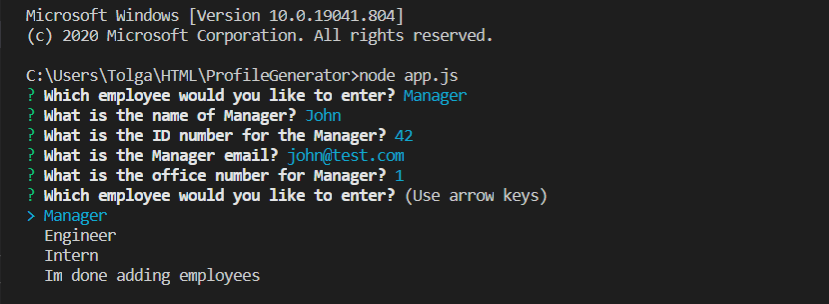
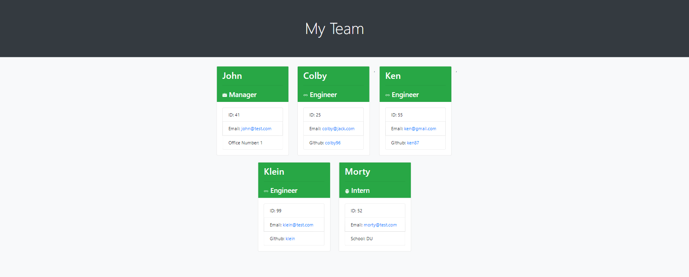
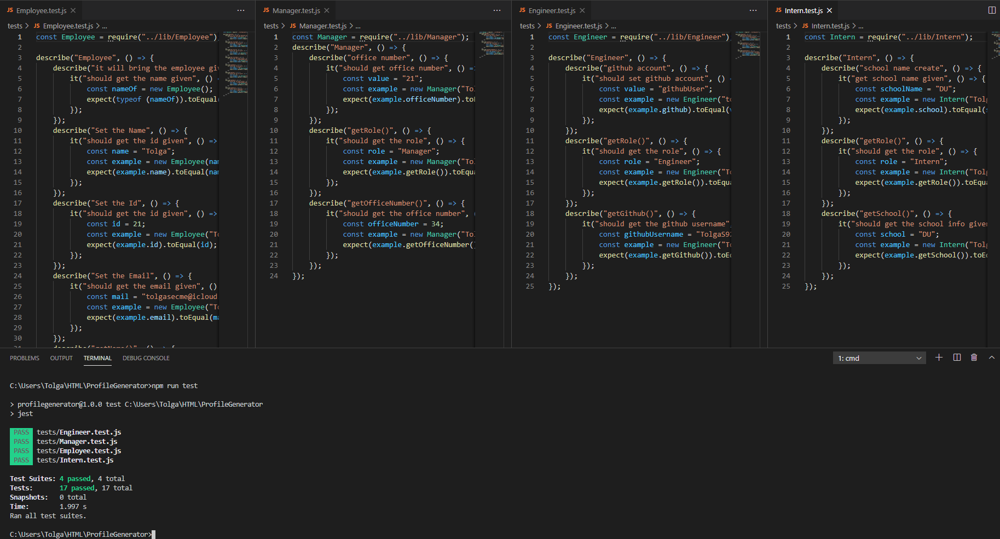

# Profile Generator

## Contents

1. [Technologies-Used](#Technologies-Used)
2. [Description](#Description)
3. [Installation](#Installation)
4. [Usage](#Usage)
5. [Credits](#Credits)
6. [License](#License)
7. [Contributing](#Contributing)
8. [Tests](#Tests)
9. [Questions](#Questions)
9. [Video](#Video)
10. [Link-to-sample-HTMLPage](#Link-to-sample-HTMLPage)

## Technologies-Used
1. HTML5
2. Javascript
3. CSS3
4. Node.js
5. Node packages
	* Inquirer
	* Jest(for testing)
    * OOP

## Description 
- Generating a website that displays the team members with their short information like github user id, email. 

## Installation
- You will need to fork and clone the repo, after you have done these sections, you'll need to run app.js file in your terminal, and follow the questions, and put the information which you would like to provide.

## Usage
- User needs to run this application with the terminal, and answer the following questions, at the end of employees to add, it should get the teamprofilepage.html file in the folder.

## Credits
- No credits

## Contributing
- No contributes.

## Tests
- Jest package used for Test,  done for employee.js / intern.js / manager.js / engineer.js. And they are all inside of the tests file, and it can be check with terminal. They are all working properly.
- 

##   Questions
- E-mail me for any questions [tolgasecme@icloud.com](mailto:tolgasecme@icloud.com)
- Also you can find me on Github [TolgaS92](https://github.com/TolgaS92).

## Video
1. [Profile Generator](https://drive.google.com/file/d/1S3BVNxQC4FdMYeQ5PpoEBzEQuRRNzTAU/view?usp=sharing)
2. [Test run](https://drive.google.com/file/d/1P06ykWdrleM0Nxm9kqm0CZupTJh1lipq/view?usp=sharing)

## Link-to-sample-HTMLPage

- [HTMLSAMPLE](https://github.com/TolgaS92/ProfileGenerator/blob/main/TeamProfilePage/TeamProfileGenerated.html)